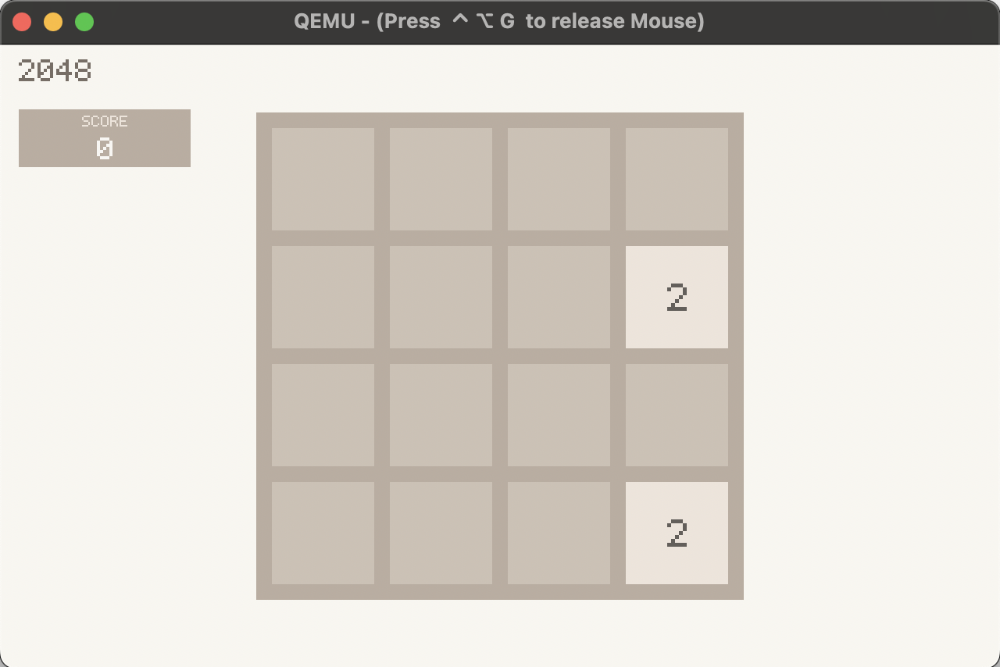
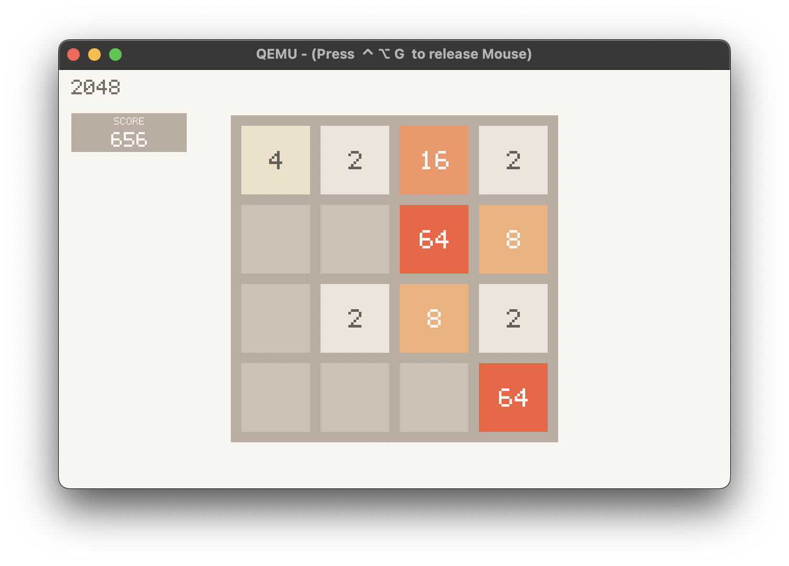
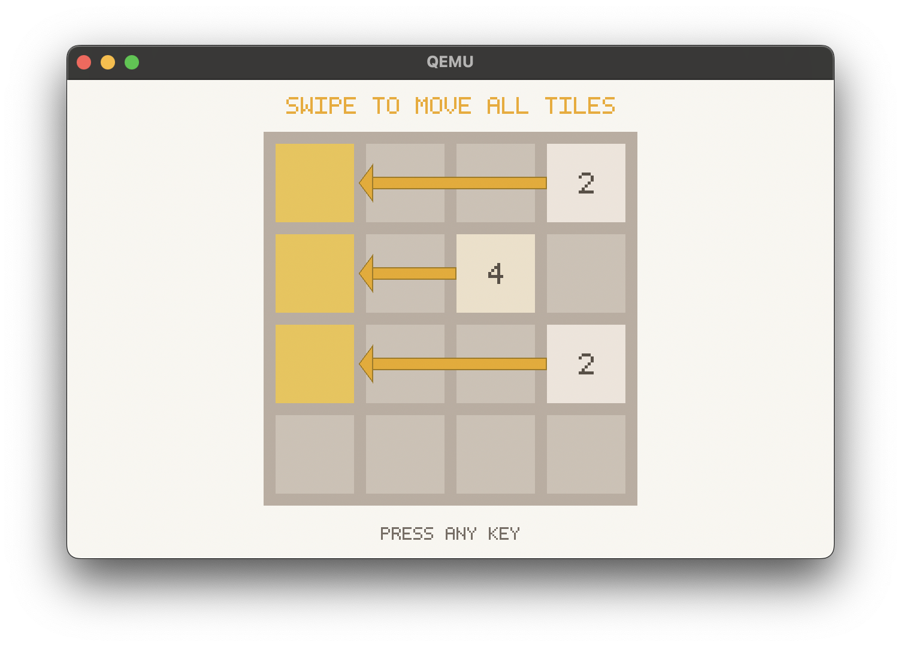
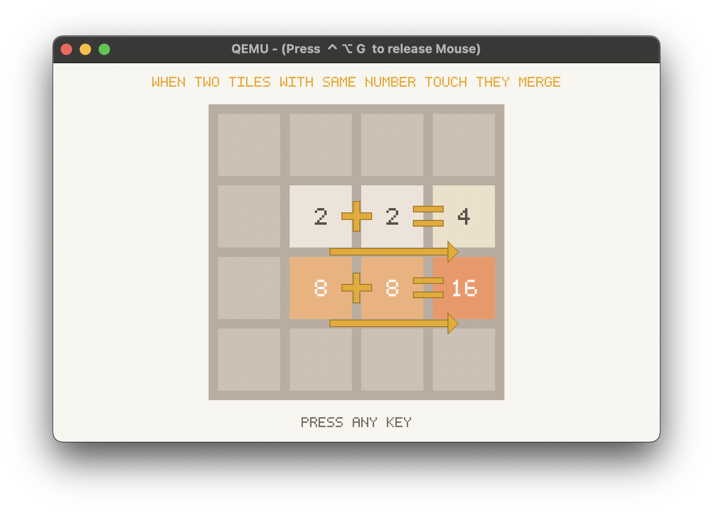
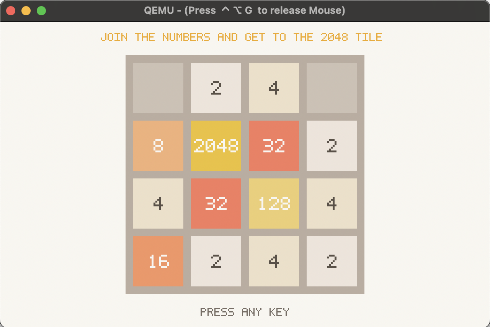
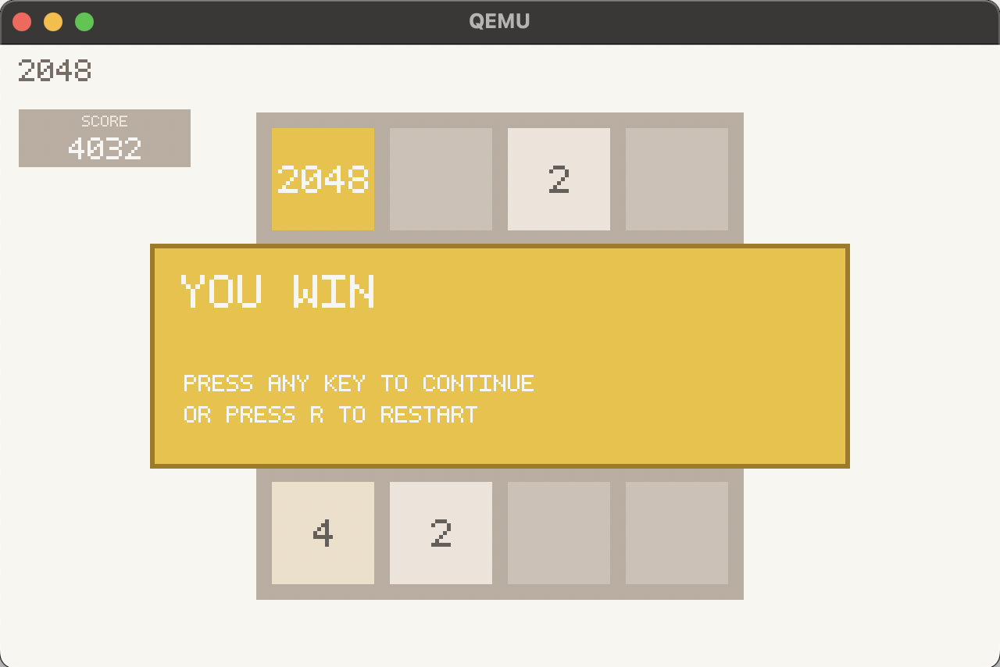
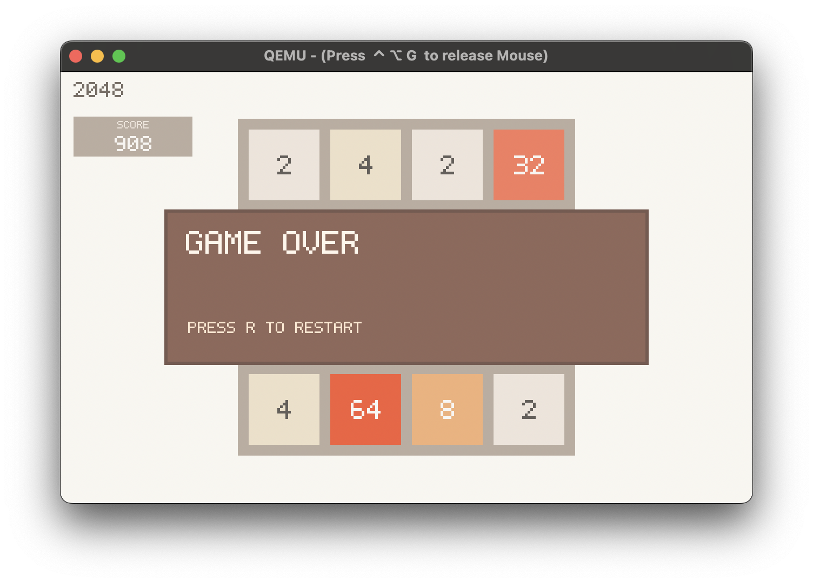

# UEFI 2048 (macOS)

Native UEFI 2048 game with a macOS-focused build and run workflow.

## Demo

[Watch the demo on YouTube](https://youtu.be/E2nCeP56KMc)

### Gameplay




### Tutorial





### Outcomes




## Controls

- Move: Arrow keys or `W/A/S/D`
- Restart: `R`
- Quit: `Q` or `Esc`

## One-Command Run

From the project root:

```bash
make build-run
```

`make build-run` will:

- build the Docker image (`uefi-2048`)
- compile a valid UEFI app (`2048.efi`) inside Docker
- run the game in QEMU via `make run`

## Manual Quickstart

1) Build `2048.efi` on macOS (Docker):

```bash
docker build -t uefi-2048 .
docker run --rm -v "$PWD":/work uefi-2048
```

2) Install runtime dependency:

```bash
brew install qemu
```

3) Run:

```bash
make run
```

`run` will:

- stage `2048.efi` to `esp/EFI/BOOT/BOOTX64.EFI`
- write `esp/startup.nsh` to auto-launch the game
- auto-detect Homebrew OVMF firmware path
- boot QEMU in UEFI mode

If you still land in the UEFI shell, run this manually in that shell:

```text
fs0:\EFI\BOOT\BOOTX64.EFI
```

## Sound Notes

- Sound cues use the UEFI terminal bell (`\a`), which is best-effort.
- `make run` enables QEMU PC speaker audio on macOS (`coreaudio` + `pcspk-audiodev`).
- Even with correct QEMU audio, some OVMF builds do not render terminal bell sound.
- If sound is still silent, check macOS output volume/device and grant audio access to your terminal/QEMU if prompted.

## Useful targets

- `make help` -> list available targets
- `make stage` -> prepare `esp/EFI/BOOT/BOOTX64.EFI` and `esp/startup.nsh`
- `make clean` -> remove build output
